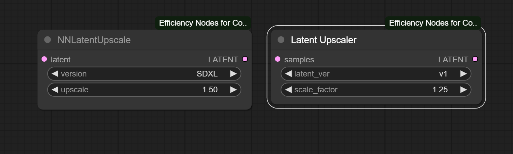
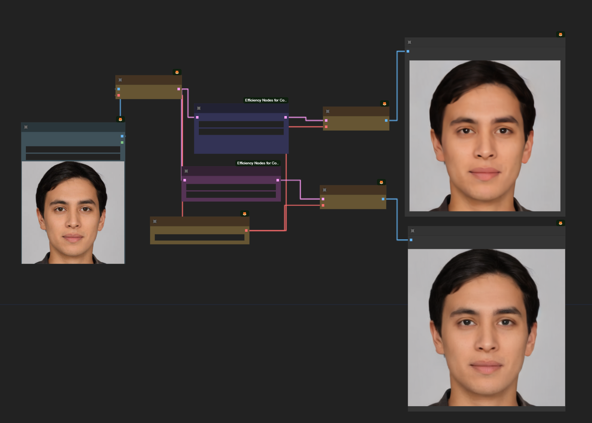

✨🍬Planning to help this branch stay alive and any issues will try to solve or fix .. But will be slow as I run many github repos . before raising any issues, please update comfyUI to the latest and esnure all the required packages are updated ass well. Share your workflow in issues to retest same at our end and update the patch.🍬

<b> Efficiency Nodes for ComfyUI Version 2.0+
=======
### A collection of <a href="https://github.com/comfyanonymous/ComfyUI" >ComfyUI</a> custom nodes to help streamline workflows and reduce total node count.
## Releases

Please check out our WIKI for any use cases and new developments including workflow and settings. 
[Efficiency Nodes Wiki](https://github.com/jags111/efficiency-nodes-comfyui/wiki) 

### Nodes:
<!-------------------------------------------------------------------------------------------------------------------------------------------------------->

    
<b>Efficient Loader</b> & <b>Eff. Loader SDXL</b>

<ul>
    <li>Nodes that can load & cache Checkpoint, VAE, & LoRA type models. <i>(cache settings found in config file 'node_settings.json')</i></li>
    <li>Able to apply LoRA & Control Net stacks via their <code>lora_stack</code> and <code>cnet_stack</code> inputs.</li>
    <li>Come with positive and negative prompt text boxes. You can also set the way you want the prompt to be <a href="https://github.com/BlenderNeko/ComfyUI_ADV_CLIP_emb">encoded</a> via the <code>token_normalization</code> and <code>weight_interpretation</code> widgets.</li>
    <li>These node's also feature a variety of custom menu options as shown below.
        

         
<i>note: "🔍 View model info..." requires <a href="https://github.com/pythongosssss/ComfyUI-Custom-Scripts">ComfyUI-Custom-Scripts</a> to be installed to function.</i>
</li>
    <li>These loaders are used by the <b>XY Plot</b> node for many of its plot type dependencies.</li>
</ul>

  
  

<!-------------------------------------------------------------------------------------------------------------------------------------------------------->

    
<b>KSampler (Efficient)</b>, <b>KSampler Adv. (Efficient)</b>, <b>KSampler SDXL (Eff.)</b>

- Modded KSamplers with the ability to live preview generations and/or vae decode images.
- Feature a special seed box that allows for a clearer management of seeds. <i>(-1 seed to apply the selected seed behavior)</i>
- Can execute a variety of scripts, such as the <b>XY Plot</b> script. To activate the <code>script</code>, simply connect the input connection.

  
  &nbsp; &nbsp; &nbsp;
  
  &nbsp; &nbsp; &nbsp;
  

<!-------------------------------------------------------------------------------------------------------------------------------------------------------->

    
<b>Script Nodes</b>

    
- A group of node's that are used in conjuction with the Efficient KSamplers to execute a variety of 'pre-wired' set of actions.
- Script nodes can be chained if their input/outputs allow it. Multiple instances of the same Script Node in a chain does nothing.
    

      
    

    <!-------------------------------------------------------------------------------------------------------------------------------------------------------->
    

        
<b>XY Plot</b>

    <ul>
        <li>Node that allows users to specify parameters for the Efficiency KSamplers to plot on a grid.</li>
    </ul>
    

      
    

    
    

    <!-------------------------------------------------------------------------------------------------------------------------------------------------------->
    

        
<b>HighRes-Fix</b>

    <ul>
        <li>Node that the gives user the ability to upscale KSampler results through variety of different methods.</li>
        <li>Comes out of the box with popular Neural Network Latent Upscalers such as Ttl's <a href="https://github.com/Ttl/ComfyUi_NNLatentUpscale">ComfyUi_NNLatentUpscale</a> and City96's <a href="https://github.com/city96/SD-Latent-Upscaler">SD-Latent-Upscaler</a>.</li>
        <li>Supports ControlNet guided latent upscaling. <i> (You must have Fannovel's <a href="https://github.com/Fannovel16/comfyui_controlnet_aux">comfyui_controlnet_aux</a> installed to unlock this feature)</i></li>
        <li> Local models---The node pulls the required files from huggingface hub by default. You can create a models folder and place the modules there if you have a flaky connection or prefer to use it completely offline, it will load them locally instead. The path should be: ComfyUI/custom_nodes/efficiency-nodes-comfyui/models; Alternatively, just clone the entire HF repo to it: (git clone https://huggingface.co/city96/SD-Latent-Upscaler)   to ComfyUI/custom_nodes/efficiency-nodes-comfyui/models</li>
    </ul>
    

      
    

    
    

    <!-------------------------------------------------------------------------------------------------------------------------------------------------------->
    

        
<b>Noise Control</b>

    <ul>
        <li>This node gives the user the ability to manipulate noise sources in a variety of ways, such as the sampling's RNG source.</li>
        <li>The <a href="https://github.com/shiimizu/ComfyUI_smZNodes">CFG Denoiser</a> noise hijack was developed by smZ, it allows you to get closer recreating Automatic1111 results.</li>
            

<i>Note: The CFG Denoiser does not work with a variety of conditioning types such as ControlNet & GLIGEN</i>

        <li>This node also allows you to add noise <a href="https://github.com/chrisgoringe/cg-noise">Seed Variations</a> to your generations.</li>
        <li>For trying to replicate Automatic1111 images, this node will help you achieve it. Encode your prompt using "length+mean" <code>token_normalization</code> with "A1111" <code>weight_interpretation</code>, set the Noise Control Script node's <code>rng_source</code> to "gpu", and turn the <code>cfg_denoiser</code> to true.</li>
    </ul>
    

      
    

    
    

    <!-------------------------------------------------------------------------------------------------------------------------------------------------------->
    

        
<b>Tiled Upscaler</b>

    <ul>
        <li>The Tiled Upscaler script attempts to encompas BlenderNeko's <a href="https://github.com/BlenderNeko/ComfyUI_TiledKSampler">ComfyUI_TiledKSampler</a> workflow into 1 node.</li>
        <li>Script supports Tiled ControlNet help via the options.</li>
        <li>Strongly recommend the <code>preview_method</code> be "vae_decoded_only" when running the script.</li>
    </ul>
    

      
    

    
    

        <!-------------------------------------------------------------------------------------------------------------------------------------------------------->
    

        
<b>AnimateDiff</b>

    <ul>
        <li>To unlock the AnimateDiff script it is required you have installed Kosinkadink's <a href="https://github.com/Kosinkadink/ComfyUI-AnimateDiff-Evolved">ComfyUI-AnimateDiff-Evolved</a>.</li>
        <li>The latent <code>batch_size</code> when running this script becomes your frame count.</li>
    </ul>
    

      
    

    
    

<!-------------------------------------------------------------------------------------------------------------------------------------------------------->

    
<b>Image Overlay</b>

<ul>
    <li>Node that allows for flexible image overlaying. Works also with image batches.</li>
</ul>

  

 

<!-------------------------------------------------------------------------------------------------------------------------------------------------------->

    
<b>SimpleEval Nodes</b>

<ul>
    <li>A collection of nodes that allows users to write simple Python expressions for a variety of data types using the <i><a href="https://github.com/danthedeckie/simpleeval" >simpleeval</a></i> library.</li>
    <li>To activate you must have installed the simpleeval library in your Python workspace.</li>
    <pre>pip install simpleeval</pre>
</ul>

  
  &nbsp; &nbsp;
  
  &nbsp; &nbsp;
  

<!-------------------------------------------------------------------------------------------------------------------------------------------------------->

    
<b>Latent Upscale nodes</b>

<ul>
    <li>Forked from NN latent this node provides some remarkable neural enhancement to the latents making scaling a cool task</li>
    <li>Both NN latent upscale and Latent upscaler does the Latent improvemnet in remarkable ways. If you face any issue regarding same please install the nodes from this link([SD-Latent-Upscaler](https://github.com/city96/SD-Latent-Upscaler) and the NN latent upscale from [ComfyUI_NNlatentUpscale](https://github.com/Ttl/ComfyUi_NNLatentUpscale) </li>
    
</ul>

  
  &nbsp; &nbsp;
  
  &nbsp; &nbsp;
  

## Workflow Examples:

Kindly load all PNG files in same name in the (workflow driectory) to comfyUI to get all this workflows. The PNG files have the json embedded into them and are easy to drag and drop ! 

1. HiRes-Fixing 
    

2. SDXL Refining & **Noise Control Script** 
    

3. **XY Plot**: LoRA <code>model_strength</code> vs <code>clip_strength</code> 
    

4. Stacking Scripts: **XY Plot** + **Noise Control** + **HiRes-Fix** 
    

5. Stacking Scripts:  **HiRes-Fix** (with ControlNet) 
   

6. SVD workflow: **Stable Video Diffusion** + *Kohya Hires** (with latent control) 
   

### Dependencies
The python library <i><a href="https://github.com/danthedeckie/simpleeval" >simpleeval</a></i> is required to be installed if you wish to use the **Simpleeval Nodes**.
<pre>pip install simpleeval</pre>
Also can be installed with a simple pip command  
'pip install simpleeval'

A single file library for easily adding evaluatable expressions into python projects. Say you want to allow a user to set an alarm volume, which could depend on the time of day, alarm level, how many previous alarms had gone off, and if there is music playing at the time.

check Notes for more information.

## **Install:**
To install, drop the "_**efficiency-nodes-comfyui**_" folder into the "_**...\ComfyUI\ComfyUI\custom_nodes**_" directory and restart UI.

## Todo

[ ] Add guidance to notebook

# Comfy Resources

**Efficiency Linked Repos**
- [BlenderNeko ComfyUI_ADV_CLIP_emb](https://github.com/BlenderNeko/ComfyUI_ADV_CLIP_emb)  by@BlenderNeko
- [Chrisgoringe cg-noise](https://github.com/chrisgoringe/cg-noise)  by@Chrisgoringe
- [pythongosssss ComfyUI-Custom-Scripts](https://github.com/pythongosssss/ComfyUI-Custom-Scripts)  by@pythongosssss
- [shiimizu ComfyUI_smZNodes](https://github.com/shiimizu/ComfyUI_smZNodes)  by@shiimizu
- [LEv145_images-grid-comfyUI-plugin](https://github.com/LEv145/images-grid-comfy-plugin))  by@LEv145
- [ltdrdata-ComfyUI-Inspire-Pack](https://github.com/ltdrdata/ComfyUI-Inspire-Pack) by@ltdrdata
- [pythongosssss-ComfyUI-custom-Scripts](https://github.com/pythongosssss/ComfyUI-Custom-Scripts) by@pythongosssss
- [RockOfFire-ComfyUI_Comfyroll_CustomNodes](https://github.com/RockOfFire/ComfyUI_Comfyroll_CustomNodes) by@RockOfFire 

**Guides**:
- [Official Examples (eng)](https://comfyanonymous.github.io/ComfyUI_examples/)- 
- [ComfyUI Community Manual (eng)](https://blenderneko.github.io/ComfyUI-docs/) by @BlenderNeko

- **Extensions and Custom Nodes**:  
- [Plugins for Comfy List (eng)](https://github.com/WASasquatch/comfyui-plugins) by @WASasquatch
- [ComfyUI tag on CivitAI (eng)](https://civitai.com/tag/comfyui)-   
- [Tomoaki's personal Wiki (jap)](https://comfyui.creamlab.net/guides/) by @tjhayasaka

  ## Support
If you create a cool image with our nodes, please show your result and message us on twitter at @jags111 or @NeuralismAI .

You can join the <a href="https://discord.gg/vNVqT82W" alt="Neuralism Discord"> NEURALISM AI DISCORD </a> or <a href="https://discord.gg/UmSd4qyh" alt =Jags AI Discord > JAGS AI DISCORD </a> 
Share your work created with this model. Exchange experiences and parameters. And see more interesting custom workflows.

Support us in Patreon for more future models and new versions of AI notebooks.
- tip me on <a href="https://www.patreon.com/jags111"> [patreon]</a>

 My buymeacoffee.com pages and links are here and if you feel you are happy with my work just buy me a coffee !

 <a href="https://www.buymeacoffee.com/jagsAI"> coffee for JAGS AI</a> 

Thank you for being awesome!

 

<!-- end support-pitch -->

